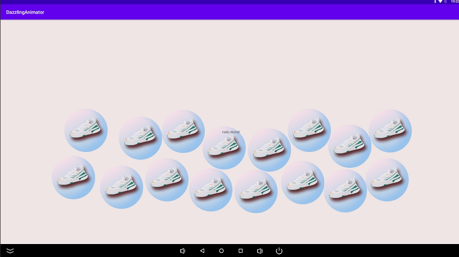

JBox2D是开源的2D物理引擎，能够根据开发人员设定的参数，如重力、密度、摩擦系数和弹性系数等，自动进行2D刚体物理运动的模拟。JBox2D中主要的几个对象：

- 刚体

主要用于存储一些刚体的属性信息，在创建刚体时是通过该类的实例给出刚体的相关属性信息，主要包括刚体位置坐标、线速度值、角速度值、线性阻尼、角度阻尼等。

- 世界

表示物理世界，物理世界就是物体、形状和约束相互作用的集合，可以在物理世界中创建或删除所需的刚体或关节以实现所需的物理模拟。要创建物理世界，必须给出其重力向量。

使用JBox2D写一个安卓炫酷的动效

